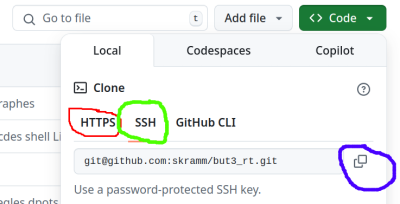

# Génération de paire de clé SSH pour utilisation sous Github

S. Kramm - IUT Rouen - 2024/09

Pour pouvoir utiliser Github, il faut au au préalable se créer un compte (gratuit) sur https://github.com.
Une fois connecté, vous pouvez créer un dépot (gros bouton vert)
et lui donner le nom demandé (cf. sujet de TP).  
**Attention** : valider la case à cocher pour avoir la création automatique du fichier `README.md`.
Ce fichier texte permettra d'une part d'avoir un dépot non-vide et surtout de donner des informations générales sur ce que contient ce dépot, au [format Markdown](https://fr.wikipedia.org/wiki/Markdown).

## Motivation

Github permet de cloner un dépot avec deux protocoles, HTTPS ou un protocole "git", s'appuyant sur le protocole SSH, et impliquant donc une authentification via une paire de clés.



Le clonage via HTTPS est le plus simple, mais a un gros inconvénient:
Pour pouvoir pousser sur le dépot, il faudra **à chaque fois** fournir un "token", qui doit préalablement être généré sur votre compte Github.
Ca peut se faire, mais à l'usage ça devient très pénible assez rapidement.

Pour éviter ceci, il est préférable de cloner via le protocole "git", qui s'appuie sur SSH.
Ceci implique de créer préalablement une paire de clés, l'une **privée**, l'autre **publique**, puis de configurer votre machine locale et votre compte Github pour pouvoir utiliser ces clés.
Les étapes ci-dessous décrivent ce processus.

> Note: La procédure complète est décrite dans ce lien, les items ci-dessous en sont un résumé simplifié:
> https://docs.github.com/en/authentication/connecting-to-github-with-ssh/generating-a-new-ssh-key-and-adding-it-to-the-ssh-agent

## Procédure

1. Dans une console ouverte dans votre "home" de votre machine (`$ cd ~`), générer une paire de clés avec:
```
$ ssh-keygen
```
- Si c'est la première fois que vous faites cette manipulation, vous pouvez valider avec entrée en laissant toutes les questions avec **les réponses par défaut**
(taper "Entrée" à chaque question).
- Si vous avez dejà fait cette opération de génération de clés pour d'autres utilisations (et que vous avez donc déjà une paire de clés), alors il faut indiquer un **autre nom** pour les fichiers contenant les clés.
Faute de quoi, vous allez écraser les clés précédentes (et les invalider si la publique est stockée quelque part).

2. Visualiser la paire de clés générée avec:
```
$ ls -l .ssh/
```
Vous devez observer deux fichiers, `id_ALGO.pub` et `id_ALGO`, avec `ALGO` étant l'algorithme utilisé pour la génération de cette paire de clés.
Selon la version/distribution Linux, vous aurez `rsa` ou `ed25519`
(sauf si vous avez donné un autre nom à l'étape précédente, évidemment).  
Le premier (`.pub`) contient la clé **publique**, que vous pouvez transmettre à tout le monde, l'autre contient la clé **privée**, qui ne devra pas quitter la machine.  
(Dans la suite, remplacer `ALGO` dans le nom de fichier par ce que vous avez.)

3. Lancer l'agent ssh local sur la machine:
```
$ eval "$(ssh-agent -s)"
```

4. Ajouter la clé **privée** à cet agent:
```
$ ssh-add ~/.ssh/id_ALGO
```

5. Ouvrir le fichier contenant la clé **publique** en tapant:
```
$ mousepad ~/.ssh/id_ALGO.pub
```
__Note__: `mousepad` est l'éditeur par défaut dans xfce4.
S'il n'est pas installé sur votre machine, vous pouvez essayer un autre éditeur GUI sans problème (pluma ou autre).
Possible aussi de faire un "`cat`", mais il faudra alors copier la clé depuis la console.

6. Sélectionner tout le contenu (CTRL-A), le copier (CTRL-C), aller sur votre profil Github en haut à droite (PAS le "settings" du projet!) et sélectionner "__Settings__".  
Dans le panneau qui s'ouvre à gauche, sélectionner "__SSH and GPG keys__", puis cliquer sur le bouton vert "__New SSH key__" et copier la clé dans la zone de texte "__Key__" avec CTRL-V.

7. Ajouter un identifiant à cette clé dans le champ "__Title__", pour pouvoir reconnaitre plus tard la machine sur laquelle vous l'avez crée.
En effet, il faudra faire cette manip sur chaque nouvelle machine où vous aurez besoin de travailler avec Github.

8. Une fois cette procédure finalisée, vous pouvez cloner un dépot:
Sur la page du dépot, cliquer sur le bouton vert "__Code__", puis cliquer sur "__SSH__" et enfin copier le lien avec le bouton en bout de ligne
(__copy URL to clipboard__)

9. Dans votre console, taper `git clone ` (avec l'espace!), puis SHIFT-CTRL-V, et entrée.  
__Note__: vous pouvez ajouter un nom de dossier en argument, si vous souhaitez créer le dépot local avec un autre nom.

10. `$ cd nom-du-depot`


