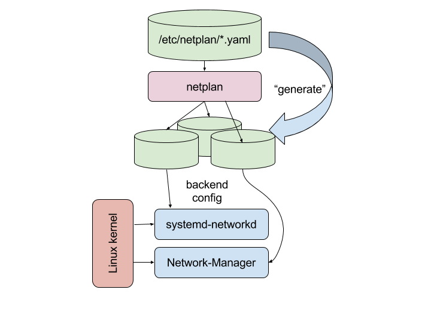

# Réseaux

20250512 - WORK IN PROGRESS

## 1 - Interfaces

La liste des interfaces réseaux est visible avec `$ ip a`
On y trouve les différents types avec notamment les mentions de leur activation ou non (`UP` ou `DOWN`).

Par exemple, pour le loopback et une interface filaire.
```
1: lo: <LOOPBACK,UP,LOWER_UP> mtu 65536 qdisc noqueue state UNKNOWN group default qlen 1000
    link/loopback 00:00:00:00:00:00 brd 00:00:00:00:00:00
    inet 127.0.0.1/8 scope host lo
       valid_lft forever preferred_lft forever
    inet6 ::1/128 scope host 
       valid_lft forever preferred_lft forever
2: eno2: <NO-CARRIER,BROADCAST,MULTICAST,UP> mtu 1500 qdisc fq_codel state DOWN group default qlen 1000
    link/ether cc:41:3b:68:af:07 brd ff:ff:ff:ff:ff:ff
    altname enp0s31f6
```
On peut aussi y trouver des interfaces virtuelles, créés par différents outils (VirtualBox, Docker, ...):

```
5: docker0: <BROADCAST,MULTICAST> mtu 1500 qdisc noqueue state DOWN group default 
    link/ether 02:42:cf:02:dd:1c brd ff:ff:ff:ff:ff:ff
7: vboxnet1: <BROADCAST,MULTICAST> mtu 1500 qdisc noop state DOWN group default qlen 1000
    link/ether 0a:00:27:00:00:01 brd ff:ff:ff:ff:ff:ff
52: br-871d5888a041: <BROADCAST,MULTICAST> mtu 1500 qdisc noqueue state DOWN group default 
    link/ether 02:42:02:df:da:08 brd ff:ff:ff:ff:ff:ff
```

## 2 - Gestion des interfaces

Sous Ubuntu, différents sous-systèmes et fichiers de configuration peuvent prendre en charge ces interfaces.
Il est parfois délicat de bien identifier quel service les prend en charge.

Il faut s'intéresser à:
- Le service "networking" historique, paramétré par `/etc/network/interfaces`.
Il peut être inactif en pratique et remplacé par un des deux suivants.
Le fichier de configuration servt surtout aux commandes `ifup` et `ifdown`:
ces dernières ne pourront activer ou désactiver une interfaces que si elle est référencée dans ce fichier.
- `netplan`, dont la configuration est dans un (des?) fichier yaml présents dans `/etc/netplan/`.
L'outil `netplan` permet de le paramétrer.
- NetworkManager, dont la configuration est dans le fichier
`/etc/NetworkManager/NetworkManager.conf`
ou dans des sous dossiers de `/etc/NetworkManager/`.
Un outil semi-GUI ("Text User Interface") permet de le configurer: `nmtui`, et la commande `nmcli` permet de scripter la configuration.


Netplan est une abstraction supplémentaire, et permet de configurer à la fois NetworkManager (Ubuntu Desktop) et systemd-networkd (Ubuntu Server). 




### Services

systemd peut afficher les services de gestion de réseau:

`$ sudo systemctl --type=service | grep -i network`

Ceci peut donner:
```
networkd-dispatcher.service                           loaded active running Dispatcher daemon for systemd-networkd
networking.service                                    loaded active exited  Raise network interfaces
NetworkManager.service                                loaded active running Network Manager
```

Sources:
- https://www.reddit.com/r/Ubuntu/comments/16oizuj/netplan_systemdnetworkd_and_networkmanager_trio/
- https://netplan.io/
- https://wiki.ubuntu.com/Netplan/Design
- https://doc.ubuntu-fr.org/netplan


## Remarques - divers

Attention: l'installation du paquet `ifupdown` va **désactiver** netplan


## ??? - items avancés

La conteneurisation apporte des problèmatiques réseaux:
sur un hote, on peut avoir des dizaines ou centaines de conteneurs, chacun nécessitant une IP.
Ceci implique un espace réseau conséquent, pas toujours disponible.

Une solution est l'utilisation de "fan".
voir https://wiki.ubuntu.com/FanNetworking

