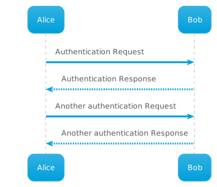
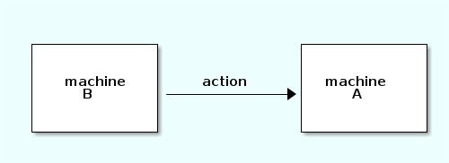
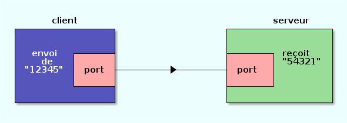
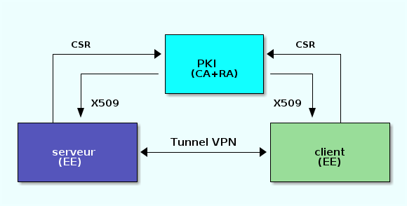

# Diagrammes "rapides"

## 1 - Introduction

On a parfois besoin d'illustrer de façon rapide un texte avec un petit diagramme montrant (par exemple) des blocs fonctionnels et leurs interactions.

Un bonne solution consiste à utiliser un logiciel de dessin **vectoriel**, c'est à dire qui produit du format [SVG](https://fr.wikipedia.org/wiki/Scalable_Vector_Graphics)
plutot que du "bitmap" (formats png et/ou jpeg).
Ceci permet de produire des dessins d'une grande qualité, qui seront intégrables en Web mais aussi redimmensionnable à volonté sans réduction de qualité (le fameux effet dit de "pixellisation").

Mais dans un contexte "IaC" (ou volonté de faire + vite), il peut être pertinent d'utiliser un outil permettant de "scripter" son diagramme, c'est à dire avoir via un outil la génération d'un fichier image à partir d'une description textuelle.

## 2 - Graphiques orientés "UML"

L'outil [`plantuml`](https://plantuml.com/) permet de scripter la production de certains diagrammes, dans un contexte ["UML"](https://fr.wikipedia.org/wiki/UML_(informatique)).

Par exemple, ceci:
```
@startuml
Alice -> Bob: Authentication Request
Bob --> Alice: Authentication Response

Alice -> Bob: Another authentication Request
Alice <-- Bob: Another authentication Response
@enduml
```
Va etre converti en ceci:



(tiré de [la doc](https://plantuml.com/sequence-diagram))

## 3 - Ascii-Art

Mais parfois, on ne souhaite pas se lancer dans la production d'un dessin élaboré et y passer du temps, mais plutot adopter une approche
"[_quick and dirty_](https://fr.wikipedia.org/wiki/Quick-and-dirty)".

Une solution est de faire du "[_ASCII-ART_](https://fr.wikipedia.org/wiki/Art_ASCII)" et dessiner vite fait dans un éditeur texte l'illustration désirée.

Un exemple d'ASCII-Art est le programme `cowsay` qui, à partir de cette commande:
```
$ cowsay "Devops rulz!"
```
génère ce type de dessin:
```
 _________________
< 60 Devops rulz! >
 -----------------
        \   ^__^
         \  (OO)\_______
            (__)\       )\/\
                ||----w |
                ||     ||
```

On peut donc "dessiner" des diagrammes en ASCII-Art:
```
 +-------------+               +-------------+
 |             |               |             |
 |             |               |             |
 |   machine   |    action     |  machine    |
 |     B       |-------------->|     A       |
 |             |               |             |
 |             |               |             |
 +-------------+               +-------------+
```

Il existe même des outils web permettant d'accélerer la génération de tels fichiers texte, par exemple
https://textik.com/.
Il peut en effet être assez laborieux de produire ces graphiques "à la main" dans un éditeur texte...

On peut insérer ceci dans un fichier Markdown, mais le rendu reste assez basique.
Il est possible de l'améliorer via l'outil [`ditaa`](https://ditaa.sourceforge.net/),
qui va convertir un fichier Ascii en une image de qualité un peu supérieure.

Avec le texte ci-dessus dans un fichier `exemple1.ditaa`, la commande
```
$ ditaa exemple1.ditaa
```
va produire cette image:



On peut faire des choses un tout petit peu plus élaboré en ajoutant quelques options (couleur des blocs, du fond, etc.).


Par exemple, un fichier `socket.ditaa` contenant ceci:

```
      client                                serveur
+----------------+                  +-----------------+
|cBLU            |                  | cGRE            |
|                |                  |                 |
|  envoi  +------+                  +-------+ reçoit  |
|    de   |cPNK  |                  |cPNK   | "54321" |
| "12345" | port +--------->--------+ port  |         |
|         |      |                  |       |         |
|         +------+                  +-------+         |
|                |                  |                 |
+----------------+                  +-----------------+
```

va générer cette image:




Un fichier `PKI1.ditaa` contenant ceci:

```
                     +-------------+
        CSR          |c1FF         |    CSR
     +-------------->+             |<---------+
     |               |    PKI      |          |
     |   +-----------|   (CA+RA)   |------+   |
     |   |           |             |      |   |
     |   |           +-------------+      |   |
     |   | X509                      X509 |   |
     |   v                                v   |
+----+---+-------+                  +-----+---+------+
|cBLU            |                  | cGRE           |
|                |    Tunnel VPN    |                |
|    serveur     +<---------------->+     client     |
|     (EE)       |                  |      (EE)      |
|                |                  |                |
+----------------+                  +----------------+
```

va générer ceci:




## 4 - Demo

Vous pouvez re-générer ces images en exécutant le script [`run.sh`](run.sh) de ce dossier.
Il faudra au préalable avoir installé Ditaa avec:
```
$ sudo apt install ditaa
```

