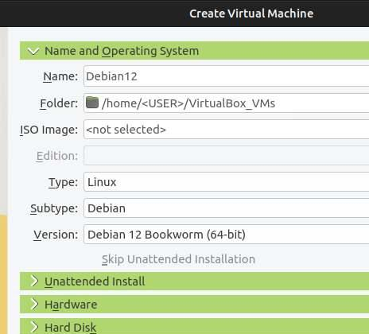
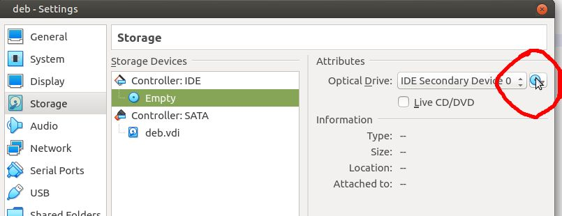
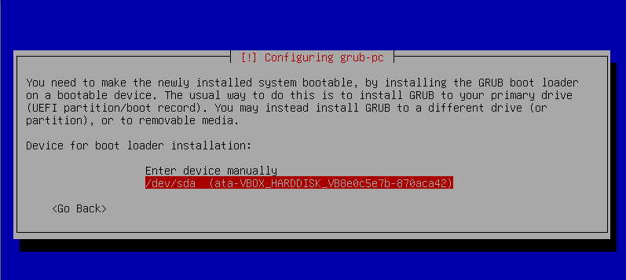

# Installation de VM Debian sous VirtualBox

Note 1: suppose une install VirtualBox version 6 ou 7 (l'interface graphique change légèrement entre ces deux versions).

Note 2: le 1er caractère des commandes ci-dessous (`#` ou `$`) indique respectivement si vous etes loggé en "root" (`#`)  ou en utilisateur standard (`$`).
Ceci a une importance, **vérifiez!**

**Note 3**: en cas de doute sur l'une des étapes ci-dessous, ou si ça ne vous parait pas clair, **demander des précisions** à l'enseignant:
toute manip hasardeuse risque de vous obliger tout recommencer et vous faire perdre du temps.


## Procédure

1. Créer une nouvelle VM dans VirtualBox de type "Debian 64bits", et la nommer `debian12`.
Lui assigner 4096 MB de RAM et un disque de 32 GB.
Laisser les autres options à leur valeur par défaut.

**NE PAS LUI ASSIGNER d'ISO !**



2. Télécharger l'ISO amd64 de la version 12 de Debian
(codename "Bookworm") pour l'architecture `amd64`, en version **netinst**
(ISO de taille minimale, et installation du reste via le réseau):  
https://www.debian.org/releases/bookworm/debian-installer/

Le fichier à télécharger doit s'appeler:
`debian-12.X.Y-amd64-netinst.iso`
<br>
(avec "X.Y" un numéro de version)

3. Une fois la machine créée, la sélectionner dans VirtualBox et dans ses paramètres, dans la section "Storage", cliquer sur l'icone de disque optique et aller sélectionner l'ISO que vous venez de télécharger:




4. Démarrer la VM et installer l'OS en suivant les différents écrans.

**Bien lire le texte affiché**, et répondre de façon adéquate.
Si rien n'est précisé ci-dessous, laisser la valeur par défaut.


  - au démarrage de la procédure d'install, choisir l'install **non-graphique**!!;
  - laisser la langue en anglais mais bien indiquer dans les étapes après le clavier français;
  - donner "root" comme mdp admin et créer un utilisateur `user` avec le mdp: `user`;
  - laisser les options par défaut pour le partitionnement du disque (tous les fichiers dans la même partition);
  - lors de la sélection du miroir pour les paquets, bien choisir la France, puis laisser le choix par défaut;
  - **POINT CLÉ: install grub**: Lors cette étape, il faut **modifier** le choix par défaut (install manuelle) et choisir l'installation de Grub sur la partition, comme ci-dessous:


  
  - lors de la sélection des logiciels à installer, **décocher** avec la touche SPC ("Espace") les bureaux mais laisser les utilitaires (voir ci-dessous).


5. Une fois l'OS installé, se logger en "root", et après un `apt update/apt upgrade`, installer le bureau "xfce4" et l'utilitaire "sudo":

`# apt install xfce4 sudo`

6. Ajouter l'utilisateur `user` au groupe des "sudoers" avec:
```
# /sbin/usermod -aG sudo user
```

7. Rebooter avec:
```
# /usr/sbin/shutdown -r now
```

8. Se logger en "user" puis, via le terminal "xterm", installer les paquets suivant:

`$ sudo apt install firefox-esr xfce4-terminal mousepad unzip`

(Note: `firefox-esr` est la version "_Extended Support Release_")

9. Redémarrer la machine, puis une fois le bureau actif, se logger en "user".
Ouvrir un terminal et taper:
```
$ xrandr --size 1280x960
```
Si cette définition parait inadaptée (ou si la commande échoue), vous pouvez afficher la liste des définitions d'écrans disponibles avec
```
$ xrandr
```
et en choisir une autre.

**Note**: les VM VirtualBox ont une tendance à rebasculer sur une définition d'écran minimale de temps en temps.
Pour éviter ça, et pour être sur qu'à chaque reboot on ait la bonne définition, vous pouvez ajouter la ligne ci-dessus à la fin de votre fichier `~/.bashrc`.
Si la définition change en cours de travail, vous pouvez simplement taper:
```
$ source ~/.bashrc
```
(ou `$ source .bashrc` si vous êtes déjà dans le dossier personnel de `user`).


## Utilisation de Docker ##

Si vous souhaiter utiliser Docker dans cette VM, [voir ici pour son installation](../docker_install/)


