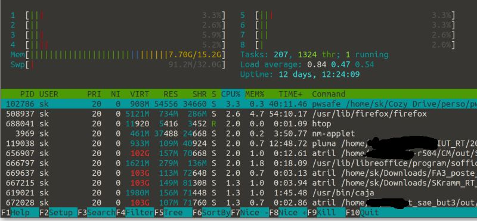
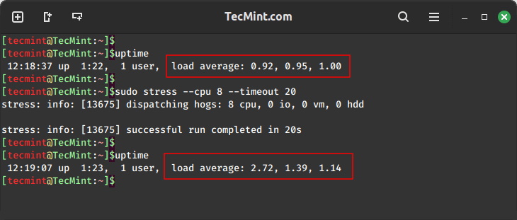

# Outils de monitoring et de simulation de charge

Cette page référence de façon **non exhaustive** différents outils et techniques pour:

- générer du traffic artificiel sur une machine
- générer des informations sur le comportement de la machine 

Lorsqu'on met en place un serveur, on veut souvent pouvoir tester son fonctionnement et voir son comportement quand la "charge"
(nbe de connexions par minute) augmente.
Les principaux items auquels on s'intéresse sont:
- la RAM
- le stockage disque
- la charge CPU

## 1 - Génération de charge réseau
Différentes solutions existent, de la plus simple à la plus évoluée.
Quelques pistes:

- Curl:
```
$ curl -s "https://google.com?[1-1000]"
```
(source: https://serverfault.com/a/358464/178363)  
Ceci va générer 1000 requetes.
On peut spécifier de nombreuses options et en particulier préciser les "__headers__" HTTP, ou envoyer du contenu avec un `POST`.
Voir le manuel.
- Apache fournit son propre testeur de charge, qui s'appelle "ApacheBench" (`ab`):  
https://httpd.apache.org/docs/current/programs/ab.html  
(peut s'utiliser pour tester un Nginx aussi)
- `hey`, très simple à utiliser (`apt install hey`)
- Un outil assez évolué: `vegeta`  
https://github.com/tsenart/vegeta
- `wrk`:  
https://github.com/wg/wrk

D'autres outils sont présentés ici:  
https://github.com/denji/awesome-http-benchmark


## 2 - Charge de la machine

On parle ici de "Monitoring" de la machine (ou du conteneur)

Des outils très évolués existent, mais il peut être pertinent de commencer par le "bas niveau", via des outils simples donnant accès aux paramètres essentiels de la machine.


### 2.1 - Monitoring temps réel
La commande `htop` montre sur un écran unique les différents paramètres.
Fonctionne en mode console, donc accessible même si le serveur n'a pas de bureau graphique.

[](https://fr.wikipedia.org/wiki/Htop)


### 2.2 - Etat de la RAM

Pour la RAM uniquement:
- la commande `free` montre la quantité de RAM libre et utilisée sur une machine, de façon ponctuelle  
(à utiliser avec l'option `-h` pour avoir des unités "humaines").  
- la commande `watch` permet d'exécuter une commande de façon périodique, en mettant à jour sur la même console.
- On peut associer les deux pour visualiser en temps réel l'état de la RAM sur la machine concernée avec:
```
$ watch free -h
```

La commande free fait en fait une extraction des données fournies par le kernel, qui sont accessibles dans le fichier virtuel
`/proc/meminfo`.
A tester:
```
$ cat /proc/meminfo
```

Si on ne veut que les infos sur la RAM libre, on peut faire:
```
$ cat /proc/meminfo | grep MemFree
```

On peut voir l'évolution en temps réel avec:
```
$ watch 'cat /proc/meminfo | grep MemFree'
```


Si on souhaite réaliser un "logging" de certaines infos, par exemple de la RAM libre, on peut faire:
```
$ cat /proc/meminfo | grep MemFree >> fichierlog
```
Mais il faut la répeter "manuellement" (donc pas pratique).
Pour logger ça toutes les secondes, on peut faire ceci:
```
while sleep 1; do cat /proc/meminfo | grep MemFree; done  >> fichierlog;
```
On peut même ajouter un "Timestamp" avec le format "%T" de la commande `date`:
```
while sleep 1; do echo -n "$(date +%T): "; cat /proc/meminfo | grep MemFree; done  >> fichierlog;
```
(N'hesitez pas à tester ça vous même!)


Si on veut utiliser le "daemon" `journalctl`, ce sera:
```
$ cat /proc/meminfo | grep MemFree | systemd-cat
```
(voir les options permettant de préciser le degré de criticité.)


### 2.3 - Charge processeur

Selon le nombre de requetes, les CPU d'un serveur peuvent être surchargés, rendant la machine peu réactive.
On peut monitorer cette charge via le concept de __Load Average__ (fr: moyenne du "Facteur de charge").

Ceci est caractérisé par 3 valeurs, montrant sur 3 intervalles de temps différents
(1 mn, 5mn, 15mn) la **moyenne du nombre de process en cours d’exécution**.

#### 2.3.1 - Monitoring
On y accède en temps réel via `htop` (voir ci-dessus).

Pour logger cette valeur, deux solutions:
- via le fichier (virtuel) `/proc/loadavg`:
```
$ cat /proc/loadavg
0.14 0.05 0.06 1/122 13870
```
- via la commande `uptime`:
```
$ uptime
 09:49:36 up 21 days, 11:08,  1 user,  load average: 0,28, 0,28, 0,47
```
Ces deux commandes peuvent être loggées facilement via une redirection, comme ci-dessus.

Plus de détails ici:
https://www.digitalocean.com/community/tutorials/load-average-in-linux

#### 2.3.2 - Génération de charge CPU

On peut facilement générer une charge CPU artificielle avec la commande `stress`
(l'installer si besoin avec le paquet du même nom).



voir https://www.tecmint.com/linux-cpu-load-stress-test-with-stress-ng-tool/


