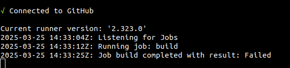

WIP, BROUILLON

# Utilisation d'un Self Hosted Runner Github


Refs:  
- https://docs.github.com/en/actions/hosting-your-own-runners/managing-self-hosted-runners/adding-self-hosted-runners


## 1 - Introduction

Par défaut, l'éxécution des taches prévues dans votre fichier yml se fait dans une VM hébergée chez Github, appellée "_Runner_".

A chaque éxécution du workflow, cette machine est lancée, fait un "checkout" du dépot (via la tâche 
`actions/checkout@v4`) puis exécute ce que vous avez indiqué.

Toutes ces étapes sont loggées et on voit le résultat en ligne sur la page
https://github.com/USER/NOM-DEPOT/actions
et en sélectionnant le dernier "push" qui a provoqué l'exécution du workflow.

Mais on peut aussi faire en sorte que l'exécution du workflow se fasse non pas sur une VM chez GH, mais sur **une machine quelconque**.

Dans cette partie, vous allez mettre en place un "runner" sur la machine de TP.

1 - Spécification du workflow

Il faut avoir un fichier .yml fonctionnel, et une seule ligne est à changer pour chaque "job".
Il faut remplacer la ligne:
```
runs-on: ubuntu-latest
```
par:

```
runs-on: self-hosted
```

## 2 - Installation d'un "Runner" en local.

Plusieurs étapes sont à prévoir:  
- configuration du dépot pour utiliser un runner externe
- téléchargement et configuration du runner
- lancement du runner sur la machine locale

La première partie est décrite ici:
https://docs.github.com/en/actions/hosting-your-own-runners/managing-self-hosted-runners/adding-self-hosted-runners

Pour la partie installation, suivre la procédure détaillée ici:  
https://github.com/USER/NOM-DEPOT/settings/actions/runners/new

Lors de l'étape de configuration, vous pouvez laisser les champs à leur valeur par défaut.

Une fois la configuration terminée, vous pouvez lancer le runner avec:
```
$ ./run.sh
```
Ceci provoque l'affichage d'un message indiquant que le runner est fonctionnel et à l'écoute:

```
√ Connected to GitHub

Current runner version: '2.323.0'
2025-03-25 13:54:53Z: Listening for Jobs
```

Vous pouvez vérifier dans l'interface web de GH que le runner est actif, en vous connectant sur:  
https://github.com/USER/NOM-DEPOT/settings/actions/runners/

Les états possibles seront:  
- _Idle_: The runner is connected to GitHub and is ready to execute jobs.
- _Active_: The runner is currently executing a job.
- _Offline:_ The runner is not connected to GitHub.


On peut maintenant faire un "push" sur le dépot et observer l'exécution du workflow sur l'interface web de GH
de la même façon que s'il s'éxecutait sur un runner GH.

Sur votre machine, dans la console où vous avez lancé le runner, vous pouvez juste observer l'échec ou la réussite du workflow.
Par exemple:



Les étapes du workflow sont néanmoins loggées dans une sous-dossier `_diag`, dans un fichier `.log` horodaté, pour chaque exécution.


Attention:
si le dépot est public, n'importe qui peut "forker" votre dépot, y ajouter du code potentiellement malveillant
et lancer le workflow sur **VOTRE** machine!
Il y a là une faille de sécurité béante et un risque de compromission de votre machine.

Pour éviter tout risque, la solution recommandée est de passer son dépot en privé.
A défaut, il ne faut lancer le runner que au moment où on fait le "push", et l'arreter (CTRL-C) une fois tout le workflow terminé.

Note: la doc GH indique qu'il est possible de configurer votre runner local en "service", géré par systemd.
Ceci peut-être particulièrement risqué, pour les raisons évoquées ci-dessus.


### 3 - travail à effectuer


