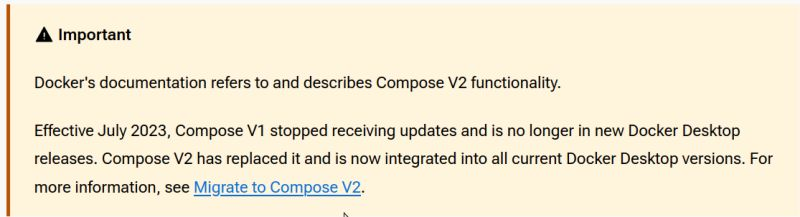

# Installation de docker compose

## 1 - Contexte historique

A l'origine, le projet était un binaire séparé de docker, avec le nom `docker-compose`.

Depuis juillet 2023, ce projet a été déprécié, en faveur d'une intégration
des fonctionnalités au binaire `docker`, via la sous-commande:
`$ docker compose <args>`



Si votre installation de docker n'en dispose pas, il faut alors installer et utiliser le binaire séparé `docker-compose`.

## 2 - Installation du binaire `docker-compose`  

Vérifier d'abord la dernière version disponible ici et la noter:

https://github.com/docker/compose/releases/

Puis exécuter les commandes suivantes dans votre VM, en remplacant `XXX` par la dernière version
(par exemple `2.17.2`):
```
# téléchargement du binaire
wget https://github.com/docker/compose/releases/download/vXXX/docker-compose-linux-x86_64

# déplacement dans les programmes locaux
sudo mv docker-compose-linux-x86_64 /usr/local/bin

# ajout flag "x"
cd /usr/local/bin
sudo chmod a+x docker-compose-linux-x86_64

# création lien symbolique
sudo ln -s docker-compose-linux-x86_64 docker-compose
cd ~
```

Puis tester ceci:
`$ docker-compose --version`

Vous devez otenir:
```
docker-compose version XXX
```
