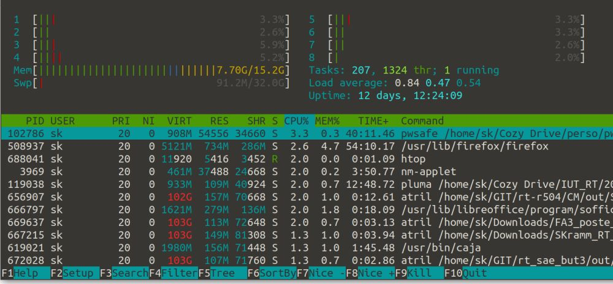

# Outils de tests de charge

Cette page référence de faon **non exhaustive** différents outils et technique pour:

- générer du traffic artificiel sur une machine
- générer des informations sur le comportement de la machine 

Lorsqu'on met en place un serveur, on veut souvent pouvoir tester son fonctionnement et voir son comportement quand la "charge"
(nbe de connexions par minute) augmente.
Les principaux items auquels on s'intéresse sont:
- la RAM
- le stockage disque
- la charge CPU

## Génération de charge réseau
Différentes solutions existent, de la plus simple à la plus évoluée.
Quelques pistes:

- Curl:
```
$ curl -s "http://google.com?[1-1000]"
```
voir https://serverfault.com/a/358464/178363
- Apache fournit son propre testeur de charge, qui s'appelle "ApacheBench" (`ab`):  
https://httpd.apache.org/docs/current/programs/ab.html  
(peut s'utiliser pour tester un Nginx aussi)
- Un outil assez évolué: `vegeta`  
https://github.com/tsenart/vegeta
- `wrk`:  
https://github.com/wg/wrk

D'autres outils sont présentés ici:  
https://github.com/denji/awesome-http-benchmark


## Charge de la machine

On parle ici de "Monitoring" de la machine (ou du conteneur)

Des outils très évolués existent, mais il peut être pertinent de commencer par le "bas niveau", via des outils simples donnant accès aux paramètres essentiels de la machine.


### Monitoring temps réel
La commande `htop` montre sur un écran unique les différents paramètres.
Fonctionne en mode console, donc accessible même si le serveur n'a pas de bureau graphique.

[](https://fr.wikipedia.org/wiki/Htop)


### Etat de la RAM

Pour la RAM uniquement:
- la commande `free` montre la quantité de RAM libre et utilisée sur une machine, de façon ponctuelle  
(à utiliser avec l'option `-h` pour avoir des unités "humaines").  
- la commande `watch` permet d'exécuter une commande de façon périodique, en mettant à jour sur la même console.
- On peut associer les deux pour visualiser en temps réel l'état de la RAM sur la machine concernée avec:
```
$ watch free -h
```

La commande free fait en fait une extraction des données fournies par le kernel, qui sont acessible dans le fichier virtuel
`/proc/meminfo`.
A tester:
```
$ cat /proc/meminfo
```

Si on souhaite réaliser un "logging" de certaines infos, par exemple de la RAM libre, on peut faire:
```
$ cat /proc/meminfo | grep MemFree >> fichierlog
```

Si on veut utiliser le "daemon" `journalctl`, ce sera:
```
$ cat /proc/meminfo | grep MemFree | systemd-cat
```
(voir les options permettant de préciser le degré de criticité.)


### __Load Average__
La commande `uptime` montre le temps depuis lequel la machine est allumée, mais aussi (et surtout) le **Load Average**, qui donne une indication de la charge CPU
(voir https://www.digitalocean.com/community/tutorials/load-average-in-linux )

Ceci peut être facilement loggé (voir ci-dessus).


