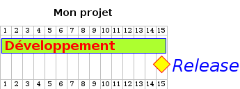
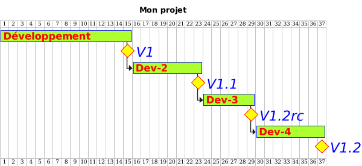
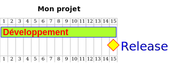
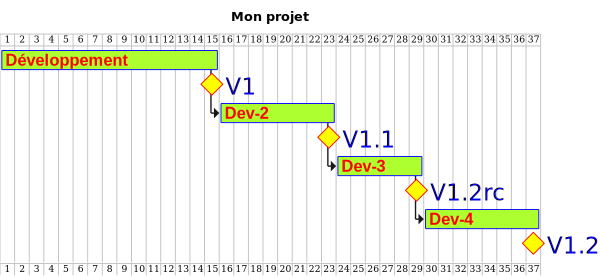

# Plantuml - Gantt

Sebastien Kramm - IUT RT Rouen

Une demo de l'utilisation de
[plantuml](https://plantuml.com/)
pour la génération de
[diagrammes de Gantt](https://fr.wikipedia.org/wiki/Diagramme_de_Gantt).
Ceci permet une approche scriptable/versionnable de vos diagrammes de Gantt.

Pour les génerer, il faut:
* avoir une install de plantuml fonctionnelle (testé avec 2023.11)
* lancer `$ ./run.sh` depuis le dossier dans une console
(la production via le makefile semble hasardeuse).

A noter qu'une intégration continue (CI) est mise en place, mais les fichiers générés ne sont pour l'instant pas uploadés
(et gh ne les conserve de toutes façons que 90 jours), donc pour plus de facilités, ils sont présents ici de façon statique.

## Exemples (version png)

* [gantt_1](gantt_1.gantt):

* [gantt_2](gantt_2.gantt):

## Exemples (version svg)

* [gantt_1](gantt_1.gantt):

* [gantt_2](gantt_2.gantt):

